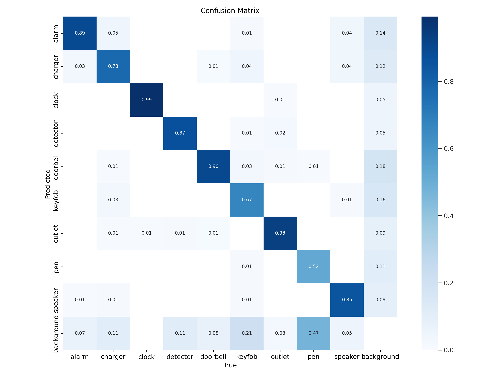

<h2> Object detection for nine types of malicious devices with hidden Wi-fi cameras</h2>
<!-- <h3>Explore the <u><a href = 'https://malicious-devices.streamlit.app/'>demo app</a></u></h3> -->
<table>
  <th>Detected classes
  <tr><td>Alarms</td><td>Speakers</td><td>Wall clocks</td></tr>
  <tr><td>Chargers</td><td>Doorbells</td><td>Power outlets</td></tr>
  <tr><td>Keyfobs</td><td>Pens</td><td>Fire detectors</td></tr>
  </table>
  <h4>Model training</h4>
  <ul>
  <li>The training dataset was made out of photos from customer reviews on web stores like Amazon and eBay.</li>
  <li>Model used: Yolov5 with AdamW</li>
  <li>Obtained results:</li>
   
  
  

  
  

  <li>See the training_notebooks folder for the training process and data augmentation details.</li><ul>
